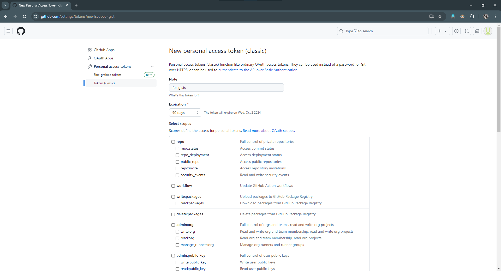
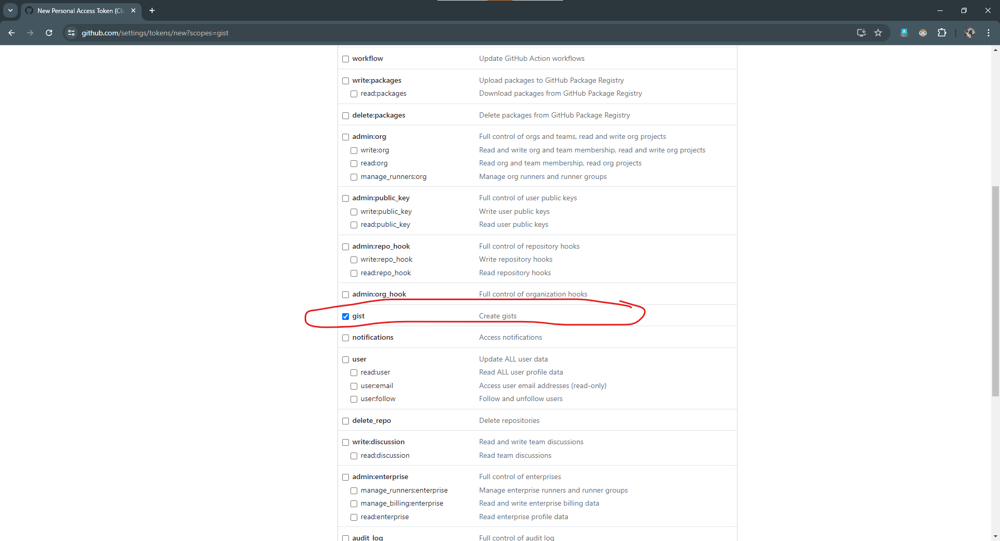
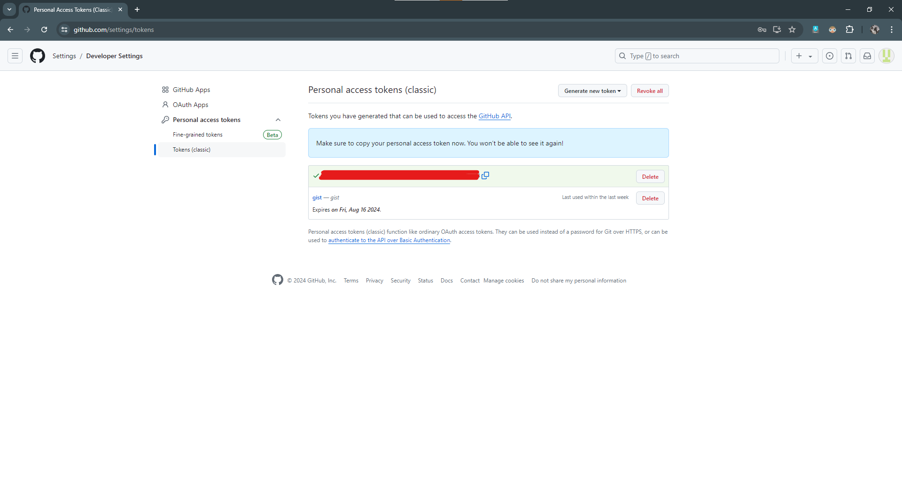
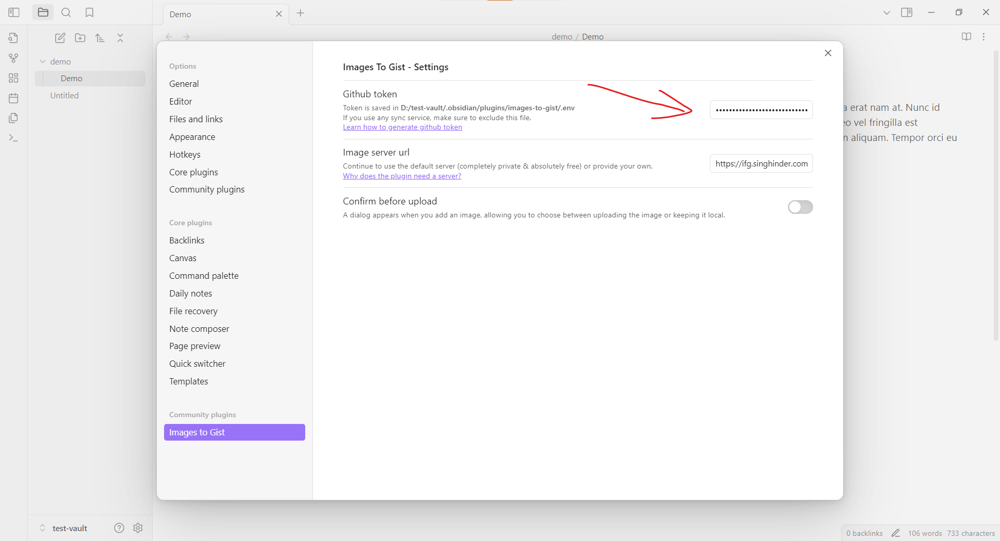

## Generate token

1. Visit [Generate a new github token](https://github.com/settings/tokens/new?scopes=gist) page. Here enter any note for the token. Set expiration date. Make sure that in scopes gist is selected and then click on generate token.

   

   

2. After you've clicked generate token button, you will be presented with your token. Copy the token, open settings inside Obsidian, go to Images to gist settings and paste the token

   

   

3. Optionally, configure the image server URL. [Why an image server is used?](https://github.com/singh-inder/obsidian-images-to-gist?tab=readme-ov-file#FAQ)

That's it, now you can use the plugin to upload images directly from your Obsidian notes to GitHub secret gists.

After uploading the image a url will be added in your markdown file. It'll be in the following format:

```
https://itg.singhinder.com?url=<GIST_URL>
```

- Here `itg.singhinder.com` points to the [image server](https://github.com/singh-inder/images-to-gist-server) which decodes base64 string and streams the image to client. If you add your own image server url in settings, your image server url will be present here.

- `GIST_URL` is the actual GitHub secret gist url.

---

## Resize

You can simply add the uploaded img url in an img tag

For example:

```
"
width=640
height=360
>
```
